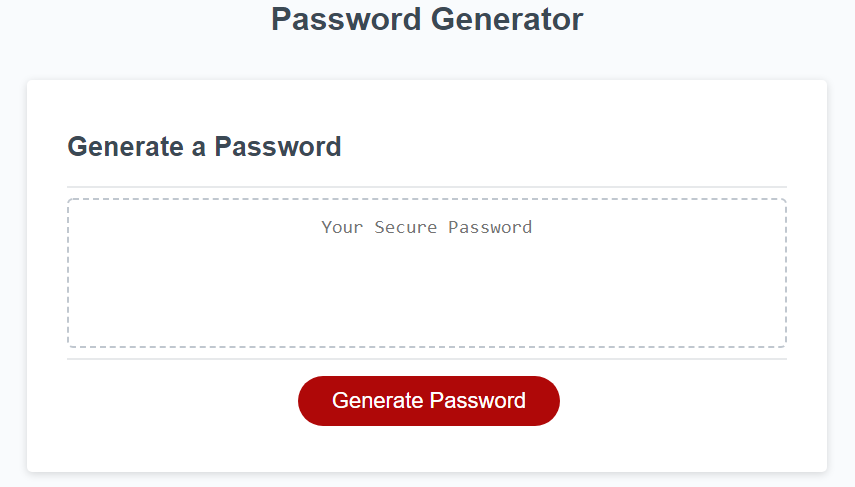

# Password-Generator

## Password Criteria Options
*   Length between 8 - 128 characters
*   Lowercase letters
*   Uppercase letters
*   Numbers
*   Special characters

When the "Generate Password" button is clicked, the user will be prompted to select at least one character type in order to produce a valid password. Otherwise they will be prompted to choose at least one character type. 
Once all prompts are answered, a unique password is displayed, matching the criteria chosen by the user.

https://savbennett8.github.io/password-generator/

